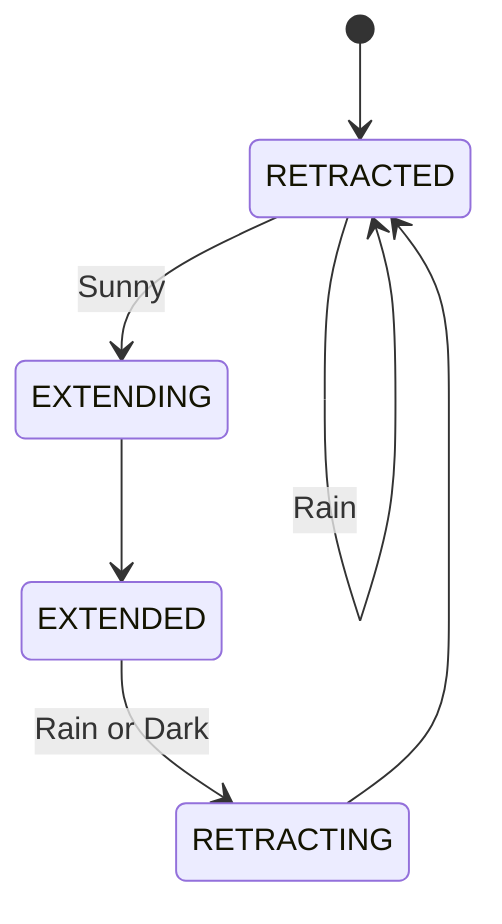

---

# ADLS: Automated Drying Line System

The **Automated Drying Line System (ADLS)** is an IoT-enabled, servo-driven laundry drying solution. It functions as a finite-state machine that responds to environmental conditions (sunlight and rain) while providing manual overrides via physical buttons and a Blynk dashboard.

---

## 🚀 Key Features
* **Intelligent Automation:** Automatically extends the drying line when sunny and retracts it during rain or darkness.
* **Dual-Mode Operation:** Switch seamlessly between **AUTO** (sensor-driven) and **MANUAL** (user-controlled) modes.
* **Fail-Safe Design:** High-priority rain detection triggers immediate retraction to protect laundry.
* **Cloud Integration:** Real-time monitoring and remote control via the **Blynk IoT** platform.
* **Visual Feedback:** Dedicated LED indicators and an LCD display for at-a-glance status updates.

**📹 Project Demo Video:** [Watch the ADLS in action on LinkedIn](https://www.linkedin.com/posts/israel-murimiro-41646a286_iot-embeddedsystems-esp32-activity-7431862936551383040-Vt_7?utm_source=share&utm_medium=member_desktop&rcm=ACoAAEV6u9IB31RgOPnDQxf6f_rhpDpxiJtxvBU)

---

## 🛠️ Hardware Requirements
| Component | Specification/Notes |
| :--- | :--- |
| **Microcontroller** | ESP32 Development Board |
| **Actuator** | Servo Motor (0°–90°) |
| **Sensors** | Rain Sensor, Light Sensor (LDR/Analog) |
| **Display** | LCD 1602 (I2C Interface - Address 0x27) |
| **Interface** | 2x Push Buttons |
| **Indicators** | LEDs (Green, Yellow, Red) |
| **Power** | External power supply recommended for servo |

### Pin Configuration
| Peripheral | Pin (GPIO) | Peripheral | Pin (GPIO) |
| :--- | :--- | :--- | :--- |
| **Light Sensor** | 34 | **Mode Button** | 16 |
| **Rain Sensor** | 32 | **Toggle Button** | 17 |
| **Servo Motor** | 13 | **LCD SDA** | 21 |
| **LED Green** | 25 | **LCD SCL** | 22 |
| **LED Yellow** | 4 | | |
| **LED Red** | 15 | | |

---

## 💻 Software & Network
* **Development Environment:** Arduino IDE (with ESP32 board package).
* **Cloud Platform:** Blynk IoT.
* **Required Libraries:** `WiFi.h`, `BlynkSimpleEsp32.h`, `ESP32Servo.h`, `LiquidCrystal_I2C.h`, `Wire.h`.

> **Note on Connectivity:** The ESP32 is compatible only with **2.4 GHz WiFi networks**. Ensure your mobile hotspot settings are adjusted accordingly before connecting.

---

## ⚙️ Logic & Operation

### State Machine Flow

---
